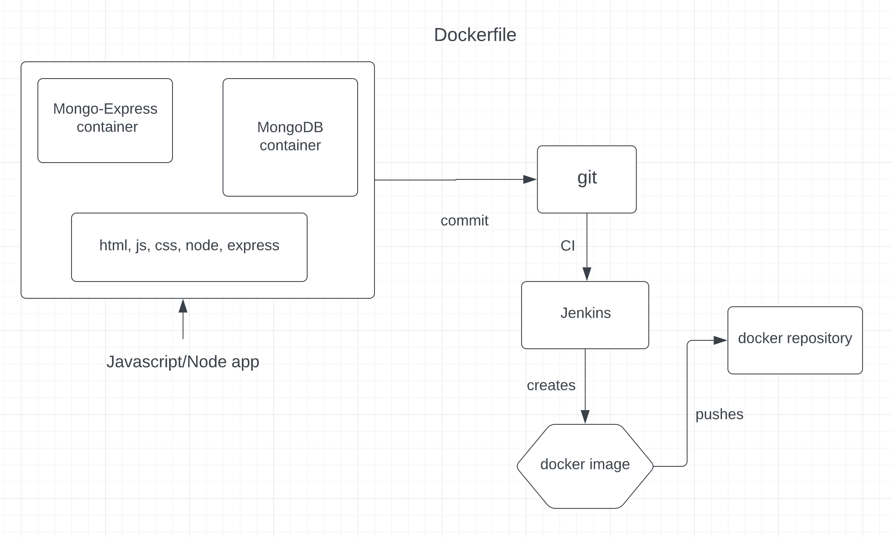

# A simple project on Docker & Node
A simple ui backend application using `JavaScript`, `Node`, `Express` to integrate with docker container of `MongoDB` database.


### Docker | Node | Express | MongoDB

          
    node --> MongoDB(docker) <--> MongoExpress(docker) 


<hr>
<br>

## Basic Docker Commands
> docker pull 

> docker run

> docker start

> docker stop

> docker ps

> docker exec -it 

> docker logs

<hr>
<br>

### Pull docker image
    docker pull mongo
    docker pull mongo-express

next step is to run mongo and mongo-express containers  in order to make mongodb database available for application and also connect

### Create docker network
    docker network create mongo-network

now have to run mongo container inside mongo-express container in docker network

### Run 'Mongo' container
```
docker run -d \
-p 27017:27017 \
-e MONGO_INITDB_ROOT_USERNAME=admin \
-e MONGO_INITDB_ROOT_PASSWORD=password \
--name mongodb-container \
--net mongo-network \
mongo
```
### Run 'Mongo-Express' container
```
docker run -d \
-p 8081:8081 \
-e ME_CONFIG_MONGODB_ADMINUSERNAME=admin \
-e ME_CONFIG_MONGODB_ADMINPASSWORD=password \
-e ME_CONFIG_MONGODB_SERVER=mongodb-container \
--name mongo-express-container \
--net mongo-network \
mongo-express
```

run `docker ps` to check if its running.  
Go to browser localhost:8081 and create a database "user-account" and create collection "users"

### Connect node server with mongo express
go to local nodejs project and start the project.

    node server.js

Go to localhost:3000


<br>
<hr>

## Using Docker Compose
create a docker compose file and configure containers as services  
run docker compose  file
> start containers
``` 
docker-compose -f mongo-docker-compose.yaml up -d
```
> stop containers  

    docker-compose -f mongo-docker-compose.yaml down -d

>Flow  



## Dockerfile
create a dockerfile.
```
FROM node:13-alpine

ENV MONGO_DB_USERNAME=admin \
    MONGO_DB_PASSWORD=pasword

RUN mkdir -p /home/app

COPY . /home/app

CMD ["node", "/home/app/server.js"]
```


## Building an image
    docker build -t my-app:1.0 .

> docker build -t <{image-name}>:<{version}> <{location-of-the-docker-file}>

## Run the container image
    docker run my-app


## Connect with GitLab or other docker container registry

- verify login through cmd

      docker login registry.gitlab.com

- build an image
      
      docker build -t <PATH_OF_GITLAB_CONTAINER>my-app:1.0 .

- push the image
        
      docker push <PATH_OF_GITLAB_CONTAINER>myapp:1.0

---
## Deploy containerized app
add new container app details in docker-compose file
``` 
version "3.1"
services: 
  my-app:
    image: <PATH_OF_REPOGITORY_IMAGE>
    ports: 
      - 3000:3000
  mongodb-container:
    image: mongo
```

run the app

    docker-compose -f mongo.yaml up

---
## Add cmd for Data Persistence
adding `Named Volumns` for data persistence
```
version: '3.1'
services:
  my-app: 
    ...
  mongodb-container:
    ...
    volumes:
      - mongo-data:/data/db
  mongo-express-container:
    ...
volumes:
  mongo-data:
    driver: local
```
save & restart docker.

---
[-p]: port flag.

[-d]: detachable mode flag.

[-e]: environmental variable flag.

[--name]: name of the running container.

[--net]: name of the network.

[--rm]: auto removes the container when stops.

[-f]: file flag

[-t]: docker image name flag while building image
